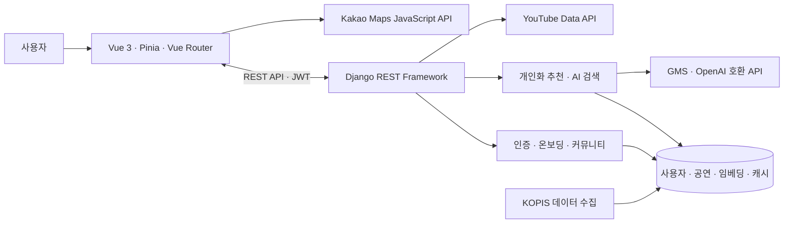

<div align="center">

<picture>
  <source media="(prefers-color-scheme: dark)" srcset="front/src/assets/images/logo-dark.png" />
  
</picture>

**공연 탐색부터 취향 학습, 개인화 추천까지 연결하는 공연 큐레이션 커뮤니티**<br />
**KOPIS 공연 데이터와 사용자 신호를 바탕으로, 보고 싶은 공연을 더 쉽게 발견합니다.**

<br />


</div>

---

## 서비스 소개

공연을 고를 때는 작품 정보, 일정, 지역, 취향을 함께 살펴봐야 합니다. PlayPick은 KOPIS 기반 공연·박스오피스 데이터를 모으고, 온보딩과 탐색 행동에서 남긴 신호를 활용해 **의미 기반 검색**과 **개인화 추천**으로 탐색 흐름을 돕는 서비스입니다.

공연 목록과 랭킹에서 후보를 살펴본 뒤, 자연어로 원하는 분위기를 검색하고, 찜·관람 기록·커뮤니티 활동으로 취향을 이어갈 수 있습니다.

**프로젝트 기간** · 2025.12.13 – 2025.12.23 · **2인 팀 프로젝트**

---

## 주요 화면과 기능

<table>
  <tr>
    <td align="center" valign="top" width="50%">
      
      <br /><strong>취향 온보딩</strong>
      <br /><sub>공연 카드에 남긴 반응으로 초기 선호도 벡터를 만듭니다.</sub>
    </td>
    <td align="center" valign="top" width="50%">
      
      <br /><strong>AI 의미 기반 검색</strong>
      <br /><sub>상황과 감정을 문장으로 입력해 관련 공연을 찾습니다.</sub>
    </td>
  </tr>
  <tr>
    <td align="center" valign="top" width="50%">
      
      <br /><strong>추천·랭킹·영상 탐색</strong>
      <br /><sub>개인화 추천, 박스오피스, YouTube 영상을 한 흐름에서 살펴봅니다.</sub>
    </td>
    <td align="center" valign="top" width="50%">
      
      <br /><strong>공연 상세와 지도</strong>
      <br /><sub>작품 정보와 일정, 공연장 위치를 함께 확인합니다.</sub>
    </td>
  </tr>
  <tr>
    <td align="center" valign="top" width="50%">
      
      <br /><strong>공연 커뮤니티</strong>
      <br /><sub>후기와 기대평을 나누고 댓글·좋아요로 소통합니다.</sub>
    </td>
    <td align="center" valign="top" width="50%">
      
      <br /><strong>마이페이지와 관람 기록</strong>
      <br /><sub>찜·관람함·작성 활동과 선호도를 한곳에서 관리합니다.</sub>
    </td>
  </tr>
</table>

| 영역 | 제공 기능 |
|---|---|
| 공연 탐색 | KOPIS 기반 목록·상세·박스오피스 랭킹, 장르 필터, 공연장 위치, YouTube 관련 영상 |
| AI 검색 | `text-embedding-3-small` 임베딩과 코사인 유사도로 자연어 질의에 맞는 공연 검색 |
| 개인화 | 온보딩 반응, 조회·찜·검색 로그, 지역·인기도·최신성·유사 공연을 결합한 추천 |
| 기록과 소통 | 찜, 관람함, 평점·후기, 댓글, 좋아요, 팔로우, 작성 활동 관리 |

---

## 추천과 검색 설계

### 7개 신호를 결합한 하이브리드 추천

추천 엔진은 공연중·공연예정 후보를 대상으로 다음 점수를 계산해 가중 합산합니다. 최근 행동에는 시간 감쇠를 적용합니다. 아래 가중치는 [`RecommendationEngine.WEIGHTS`](back/recommendations/services/engine.py)의 구현 기준입니다.

| 점수 | 가중치 | 반영 내용 |
|---|---:|---|
| `f1_click` | 10% | 최근 조회·찜·검색 로그와 장르 일치 |
| `f2_preference` | 15% | 저장한 선호 태그와 공연 장르 매칭 |
| `f3_location` | 25% | 사용자 지역과 공연 지역의 일치도 |
| `f4_popularity` | 10% | 공연 대중성 지표 또는 박스오피스 순위 |
| `f5_recency` | 10% | 시작일 기준 최신성·임박도 |
| `f6_collaborative` | 10% | 찜한 공연과 유사 공연의 관계 |
| `f7_embedding` | 20% | 사용자 선호 벡터와 공연 임베딩의 코사인 유사도 |

추천 결과에는 개별 점수가 가장 높은 항목의 사유 코드와 가중 합산 점수를 함께 반환합니다. 이 점수는 서비스 내부의 추천 점수이며, 추천 정확도나 만족도를 측정한 지표가 아닙니다.

### 온보딩에서 검색까지

온보딩은 인기·최신·다양한 장르 후보를 섞어 보여 주고, 사용자가 남긴 `보고싶어요(1.5)`, `모르겠어요(0.0)`, `안보고싶어요(-1.0)` 신호를 공연 임베딩에 반영합니다. 가중 합산한 뒤 L2 정규화하여 **1536차원 선호도 벡터**를 만들고, 이후 추천의 임베딩 점수에 사용합니다. AI 검색은 같은 차원의 `text-embedding-3-small` 임베딩으로 질의와 공연 정보를 비교합니다.

AI 검색은 유사도 상위 공연을 반환하고 `gpt-4o-mini`로 추천 문구를 생성합니다. 문구 생성에 실패하면 기본 문구를 반환합니다.

- [온보딩 구현](back/accounts/services/onboarding_service.py) · [AI 검색 구현](back/performances/services/ai_search.py)

### 화면 상태와 API 연결

Vue 3 Composition API와 Pinia로 화면 상태와 API 호출을 분리하고, `usePerformanceDetail`, `useKakaoMap`, `useArticleForm`, `useMyPage` 같은 composable에서 화면 로직을 재사용합니다. Vue Router의 온보딩 가드와 Axios JWT 인터셉터로 로그인 이후의 탐색 흐름을 연결합니다.

---

## 시스템 아키텍처



| 모듈 | 역할 |
|---|---|
| `back/accounts/` | JWT 인증, 온보딩 신호, 사용자 선호도 벡터, 관람 기록 |
| `back/performances/` | 공연·랭킹·찜, KOPIS 수집, AI 검색, YouTube 캐시 |
| `back/recommendations/` | 사용자 로그, 추천 캐시, 7개 점수 기반 추천 엔진 |
| `back/community/` | 게시글, 댓글, 좋아요, 베스트 리뷰 |

---

## 기술 스택

| 구분 | 기술 |
|---|---|
| Frontend | Vue 3.5, Vite 7, Pinia 3, Vue Router 4, Axios, Tailwind CSS 3 |
| Backend | Python, Django 5.2, Django REST Framework 3.16, Simple JWT |
| Data / AI | SQLite, NumPy, scikit-learn, OpenAI SDK, `text-embedding-3-small` |
| External API | KOPIS, Kakao Maps JavaScript API, YouTube Data API |
| Deployment | Gunicorn, WhiteNoise, AWS EC2 배포 가이드 |

---

## 저장소 구조

```text
.
├── front/                         # Vue SPA, Pinia 상태, 화면·컴포넌트·API 모듈
├── back/
│   ├── accounts/                  # 인증, 온보딩, 선호도 벡터, 관람함
│   ├── performances/              # 공연·랭킹·AI 검색·외부 API 수집
│   ├── recommendations/           # 행동 로그, 캐시, 추천 엔진
│   ├── community/                 # 게시글, 댓글, 좋아요
│   └── mypjt/                     # Django 설정
├── img/                           # README 서비스 화면
└── docs/final-submission/         # 제출용 기술·기능·API·배포 문서
```

---

## 문서와 실행 안내

| 목적 | 문서 |
|---|---|
| 프로젝트 전체 구조 | [프로젝트 종합문서](docs/final-submission/01-프로젝트-개요/01-프로젝트-종합문서.md) · [프로젝트 구조](docs/final-submission/01-프로젝트-개요/04-프로젝트-구조.md) |
| 핵심 기술 | [추천 알고리즘](docs/final-submission/02-기술-문서/01-추천알고리즘.md) · [AI 검색 엔진](docs/final-submission/02-기술-문서/02-AI-검색엔진.md) · [온보딩 시스템](docs/final-submission/03-기능-명세/01-온보딩시스템.md) |
| API | [공연 정보 API](docs/final-submission/04-API-문서/01-공연정보-API.md) · [커뮤니티 API](docs/final-submission/04-API-문서/02-커뮤니티-API.md) · [추천 API](docs/final-submission/04-API-문서/03-추천-API.md) |
| 실행·배포 | [로컬 환경 설정](docs/final-submission/05-배포-가이드/02-로컬-환경-설정.md) · [AWS 배포 실행방법](docs/final-submission/05-배포-가이드/01-AWS-배포-실행방법.md) · [Backend README](back/README.md) · [Frontend README](front/README.md) |

<details>
<summary><strong>로컬 실행 요약</strong></summary>

사전 준비: `back/requirements.txt`의 패키지를 지원하는 Python 환경, Node.js `^20.19.0` 또는 `>=22.12.0`, KOPIS·GMS·Kakao Map·YouTube API 키.

백엔드 — Windows PowerShell 기준:

```powershell
cd back
python -m venv venv
.\venv\Scripts\Activate.ps1
pip install -r requirements.txt
python manage.py migrate
python manage.py runserver
```

macOS/Linux에서는 `source venv/bin/activate`로 가상환경을 활성화합니다.

프론트엔드 — 저장소 루트에서 별도 터미널로 실행:

```sh
cd front
npm install
npm run dev
```

기본 주소는 API `http://127.0.0.1:8000/api/`, 프론트엔드 `http://localhost:5173`입니다.

| 위치 | 환경 변수 |
|---|---|
| `back/.env` | `SECRET_KEY`, `KOPIS_API`, `KOPIS_URL`, `GMS_KEY`, `YOUTUBE_API_KEY`, `YOUTUBE_PLAYLIST_ID_MAIN` |
| `front/.env` | `VITE_API_BASE_URL`, `VITE_KAKAO_MAP_API_KEY` |
| `front/.env.production` | `VITE_API_BASE_URL` |

백엔드에서 공연 데이터와 임베딩을 준비합니다.

```sh
python manage.py collect_performances
python manage.py collect_performance_detail
python manage.py collect_boxoffice
python manage.py generate_embeddings
```

환경 설정과 초기 데이터 로드·배포 절차는 [로컬 환경 설정](docs/final-submission/05-배포-가이드/02-로컬-환경-설정.md) 및 [AWS 배포 실행방법](docs/final-submission/05-배포-가이드/01-AWS-배포-실행방법.md)을 참고하세요.
</details>

---

## 팀원 소개

<table>
  <tr>
    <td align="center" valign="top" width="50%">
      <strong>이재호</strong><br />
      <sub>팀장</sub><br /><br />
      
      
      
    </td>
    <td align="center" valign="top" width="50%">
      <strong>임경수</strong><br />
      <sub>팀원</sub><br /><br />
      
      
      
    </td>
  </tr>
</table>

| 이름 | 역할 |
|---|---|
| 이재호 · 팀장 | 프론트엔드 화면 구현, UI/UX 디자인, 커뮤니티 페이지, 온보딩·YouTube·마이페이지 연동, 문서 정리, 발표 자료·발표 |
| 임경수 · 팀원 | Django API, KOPIS 데이터 수집, AI 검색·추천 시스템, 임베딩 테이블 분리, 프론트엔드 리팩토링, 배포 설정 |
